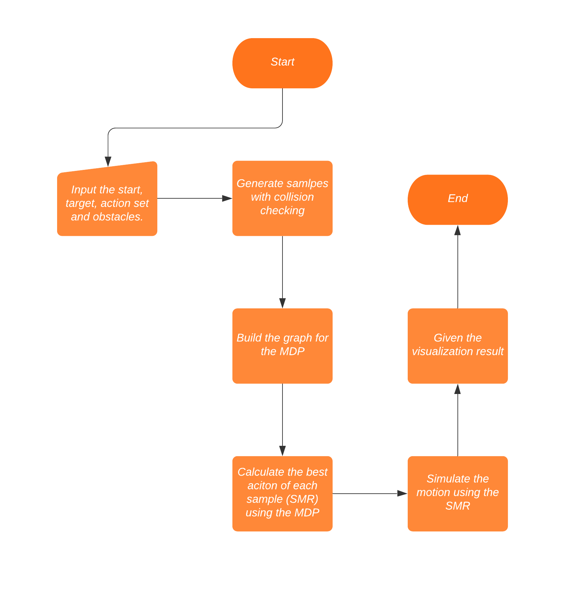
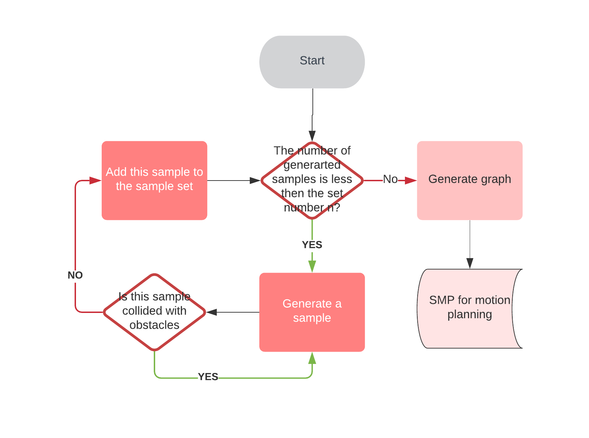
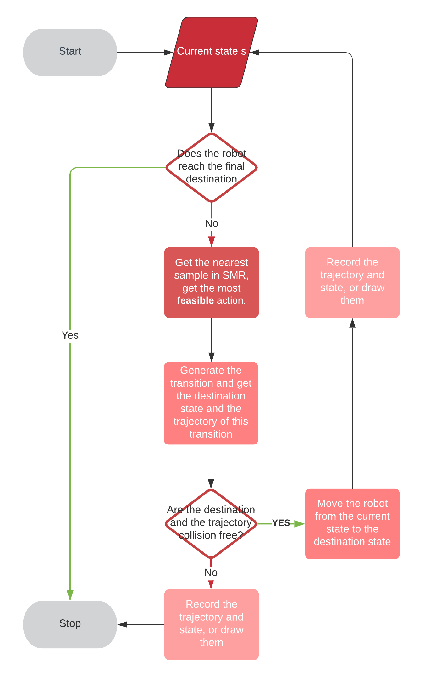

# Project 5

## A problem statement and a short motivation for why solving this problem is useful

In this project, we implemented the stochastic motion roadmap proposed by Alterovitz et al. for motion planning under action uncertainty with a 2D steerable needle. We also observe the result given by the algorithm and the impact of the parameters on the results.

The motion planning problem of a 2D steerable needle is to find a **feasible** **but** **optimal** plan. And, the SMR focus on the uncertainty of control instead of that of sensors, obstacles, or target. To be more specific, in each round of planning, the SMR can help the needle to find the more feasible plan from left-turn and right-turn to avoid collision with obstacles and reach the goal, rather than to find a shorter way to the target. Furthermore, we can simulate the uncertainty of control by giving the parameters in normal distributions. The executed parameters are random ones generated from the distributions. 

Compared with other more complex problems, the needle problem is more suitable for testing the SMR because there are only two action options. The time complexity of the problem is linear correlated to the size of the action set, so the size of 2 can save a lot of time.

Besides, we compared the result of different numbers of sampling states to show that this number is important to the SMR like other probabilistic roadmap methods.

## The details of your approach and an explanation of how/why this approach solves your problem

We didn't use the OMPL library for our experiments since we planned only to apply the SMR to this needle problem.

Firstly, Ruijin Wang implemented some functions for collision checking and most of the SMR except the MDP.

Secondly, Jiawei Bao implemented the MDP and the data visualization part.

### Collision checking

- For each sample on the 2D graph, draw a ray from the point to any direction. If the number of intersections between the ray and the obstacle is odd, the point is in an obstacle, otherwise outside of it. 

- Given the current sample $S$, rotation trajectory length $\delta$, the rotation radius $r$, and the direction $d$, we can calculte the center $O$ of this rotation and the angle $\theta$ Of this rotation.

  if d is 0 (turn left), 
  $$
  O = (x_s - r *  sin \theta, y_s + r * cos \theta)  \\
  Rotate(S, O, \delta, r) = O + (S - O) * \left(\begin{array}{cc} 
  cos\frac{\delta}{r} & sin\frac{\delta}{r}\\
  -sin\frac{\delta}{r} & cos\frac{\delta}{r}
  \end{array}\right)
  $$
  
- For each arc trajectory, judge if there is an intersection between the trajectory and any side of an obstacle. In order to do this, calculate the intersections of the circle where the arc is on and the line which the segment is on. Then, judge if these intersections are in the segment and the arc.

### SMR

The details are illustrated with following charts.

#### The Overview

#### How to Build SMR

First, generate the state the samples for the SMR.

Second, for each sample and action, get the probability of the transition from this to another sample using this action. Repeat $m$ times of transition to get more accurate estimation. Then, give a graph.

#### MDP

Use the MDP to calculate the SMR.

==(You can draw some flowchart to illustrate it.)==

#### Simulation

We can perform the uncertainty in aciton using the parameters in normal distribution. The real movement of the robot is not precisely performed during building the SMR. So, the real movement of the robot is uncertain, and the SMR can help the robot to overcome the uncertainty. 

### Data Vizualization

==(The package you use...)==

## A description of the experiments you conducted. Be precise about any assumptions you make on the robot or its environment.

## A quantitative and qualitative analysis of your approach using the experiments you conduct.

##  Rate the difficulty of each exercise on a scale of 1–10 (1 being trivial, 10 being impossible). Give an estimate of how many hours you spent on each exercise, and detail what was the hardest part of the assignment.

- Prepare for the experiments and read the paper: Scale: 8. Time: 6 hours.

  Difficultes: Some of the details are ambiguous, so cost some time to think about them.

- Code (rw48, Ruijin Wang): Scale: 8. Time: 20 hours.

  Difficultes: The OOP design and computational geometry cost most of the time.

- Conduct experiment: Scale: Time: 

  Difficultes: 

- Analyze: Scale: Time: 

  Difficultes: 

  

