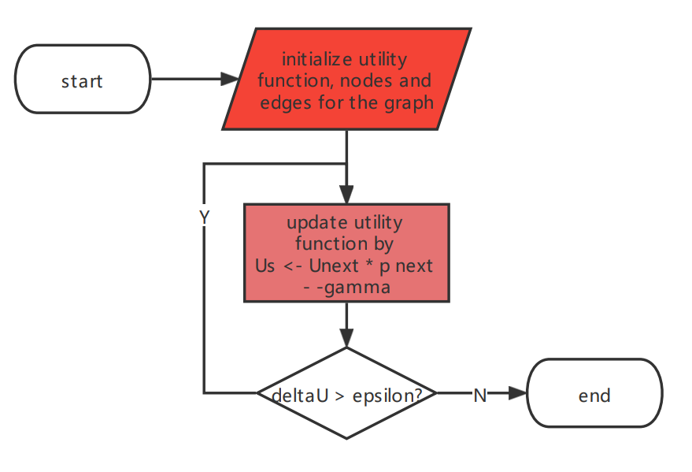
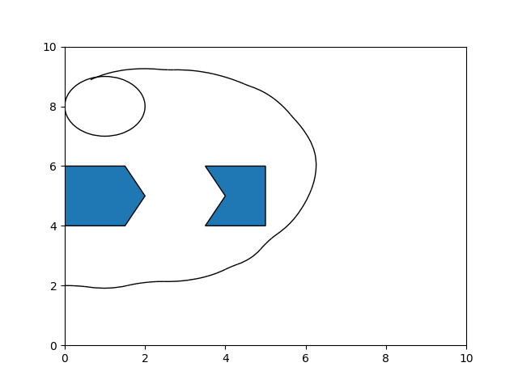
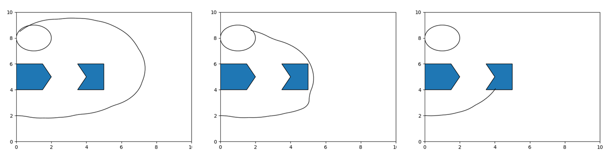

# Project 5

## A problem statement and a short motivation for why solving this problem is useful

In this project, we implemented the stochastic motion roadmap proposed by Alterovitz et al. for motion planning under action uncertainty with a 2D steerable needle. We also observe the result given by the algorithm and the impact of the parameters on the results.

The motion planning problem of a 2D steerable needle is to find a **feasible** **but** **optimal** plan. And, the SMR focus on the uncertainty of control instead of that of sensors, obstacles, or target. To be more specific, in each round of planning, the SMR can help the needle to find the more feasible plan from left-turn and right-turn to avoid collision with obstacles and reach the goal, rather than to find a shorter way to the target. Furthermore, we can simulate the uncertainty of control by giving the parameters in normal distributions. The executed parameters are random ones generated from the distributions. 

Compared with other more complex problems, the needle problem is more suitable for testing the SMR because there are only two action options. The time complexity of the problem is linear correlated to the size of the action set, so the size of 2 can save a lot of time.

Besides, we compared the result of different numbers of sampling states to show that this number is important to the SMR like other probabilistic roadmap methods.

## The details of your approach and an explanation of how/why this approach solves your problem

We didn't use the OMPL library for our experiments since we planned only to apply the SMR to this needle problem.

### Collision checking

- For each sample on the 2D graph, draw a ray from the point to any direction. If the number of intersections between the ray and the obstacle is odd, the point is in an obstacle, otherwise outside of it. 

- Given the current sample $S$, rotation trajectory length $\delta$, the rotation radius $r$, and the direction $d$, we can calculate the center $O$ of this rotation and the angle $\theta$ Of this rotation.

  if d is 0 (turn left), 
  $$
  O = (x_s - r *  sin \theta, y_s + r * cos \theta)  \\
  Rotate(S, O, \delta, r) = O + (S - O) * \left(\begin{array}{cc} 
  cos\frac{\delta}{r} & sin\frac{\delta}{r}\\
  -sin\frac{\delta}{r} & cos\frac{\delta}{r}
  \end{array}\right)
  $$
  if d is 1 (turn right), 
  $$
  O = (x_s + r *  sin \theta, y_s - r * cos \theta)  \\
  Rotate(S, O, \delta, r) = O + (S - O) * \left(\begin{array}{cc} 
  cos\frac{-\delta}{r} & sin\frac{-\delta}{r}\\
  -sin\frac{-\delta}{r} & cos\frac{-\delta}{r}
  \end{array}\right)
  $$
  
- For each arc trajectory, judge if there is an intersection between the trajectory and any side of an obstacle. In order to do this, calculate the intersections of the circle where the arc is on and the line which the segment is on. Then, judge if these intersections are in the segment and the arc.

### SMR

The details are illustrated with following charts.

The SMR is composed of two parts, the samples, and the chosen action. The algorithm uses samples to generalize all the samples in the neighbor area and give the best action of this area. 

#### The Overview

#### How to Build SMR

First, generate the state the samples for the SMR. Each sample represents all the states in the neighbor area.

Second, for each sample and action, get the probability of the transition from this to another sample using this action. Repeat $m$ times of transition to get more accurate estimation. Then, give a graph which is used to do the MDP.

#### MDP

Use dynamic programing to calculate the best action $u_i$ to make the probability $p_i$ of each node higher. Iterate the process until the probability of each node is converged.
$$
p_i = max_{u_i}\sum_{j \in V}P_{u_i, i, j}(g(i, u_i, j) + p_j)
$$
where $i$, $j$ are all nodes in the graph, and $g(i, u_i, j) = 0.00001$. $g(i, u_i, j)$ is set to a small number to avoid the circle in the calculation.

Then, get the best action for each nodes and their own neighbor area. 

#### Simulation

Perform the uncertainty in action using the parameters in a normal distribution. The real movement of the robot is not performed during building the SMR. The SMR can give the best action for current state.

### Data Visualization

Use Matplotlib to draw the images. The arc and polygon function is called to draw the path and obstacles in the solution. The eclipse surrounding the goal is the area could treat the path is successful when car moves inside.

## Experiments & Quantitative and Qualitative analysis

### Part 1

1. The path varies when we do multiple times of simulation.

2. The system sometimes reaches the goal, but sometimes not. The success ratio is varied when we apply different conditions to the parameters. Here are examples of different paths   completed or failed:

   

3. Sensitivity of probability of success to the standard deviation of the Gaussian noise distribution:

   In the paper, the standard deviation is chosen by 0.2% of average value. Here we tested standard deviation by 0.4%, 0.2%, and 0.1% of average value of average. With both 2 dimension in the control space.

   The experiment code is expe1 function in the code.

   The success ratio result is 0, 2.9% and 84.1% (we run multiple times, results could be extremely unstable here due to the quality of sample points). We can see the Sensitivity is pretty high for the probability of success to the standard deviation.

### Part 2

The difference of success probability when number of samples change:  

Here we use  n=1000, 3000, 10000, 30000 to run the experiment, the experiment parameter is expe2 function in the code. The 4 corresponding results are as follows: 0, 0, 84.1%, 92,3%. We can hardly see relationships here. But it's like the logarithmic relationship between success probability and sample numbers.

##  Rate the difficulty of each exercise on a scale of 1–10 (1 being trivial, 10 being impossible). Give an estimate of how many hours you spent on each exercise, and detail what was the hardest part of the assignment.

- Prepare for the experiments and read the paper: Scale: 8. Time: 6 hours.

  Difficultes: Some of the details are ambiguous, so cost some time to think about them.

- Code: Scale: 10. Time: 30 hours.

  Difficultes: The OOP design and computational geometry cost most of the time.

- Conduct experiment & Analyze: Scale: 10 Time: 20 hours

  Difficultes: The parameters need fine-tuning for better results. A set of comparision experiments should perform different conclusions made in the task.

